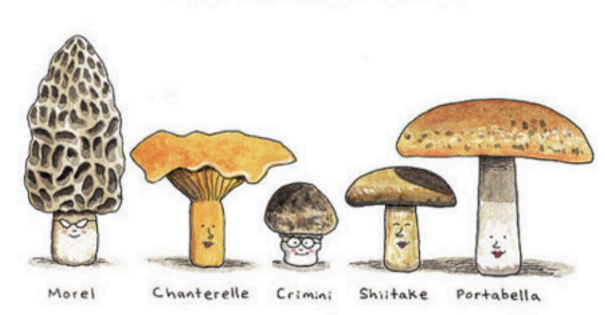

# Hi, I'm Samantha! 

I’m a **data enthusiast** with an M.S. in Data Science from Eastern University and a B.S. in Textile Engineering from NC State. I enjoy digging into data to uncover insights, build predictive models, and communicate findings visually.  

Fun fact: I’m on a mission to visit all 62 U.S. National Parks—I’ve been to 20 so far!  

  
  &nbsp;&nbsp;&nbsp;&nbsp;
  

---

## Skills & Tools

Python, NumPy, Pandas, Matplotlib, TensorFlow, Scikit-learn, R, dplyr, ggplot2, SQL, Data Visualization  

---

## Featured Projects

### Mushroom Classifier

- **Tools:** Python, TensorFlow
- **Overview:** CNN model with PCA to classify mushrooms as poisonous or edible.  
*[Private repository available upon request](https://github.com/samcirceo/MushroomClassification)*  
[View Overview](https://github.com/samcirceo/MushroomClassifierPUBLIC)

### Final Grade Predictor

- **Tools:** Python, Matplotlib, Seaborn, Scikit-learn
- **Overview:** Machine learning model predicting final grades with preprocessing, model selection, evaluation, and insights.  
*[Private repository available upon request](https://github.com/samcirceo/FinalGradePredictor)*  
[View Overview](https://github.com/samcirceo/FinalGradePredictorPUBLIC)

### Mental Health Predictor

- **Tools:** R, dplyr, ggplot2
- **Overview:** Regression model predicting mental health scores using exploratory data analysis and visualization.  
*[Private repository available upon request](https://github.com/samcirceo/MentalHealthPredictor)*  
[View Overview](https://github.com/samcirceo/MentalHealthPredictorPUBLIC)

### New York Taxi Analysis

- **Tools:** Python
- **Overview:** Regression model predicting hourly NYC taxi demand across regions.  
[View Project](https://github.com/samcirceo/New-York-Taxi-Analysis)

---

## Currently Working On
Expanding my portfolio with additional **machine learning**, **data visualization**, and **cloud deployment** projects.

---

## 📫 Contact Me

- **Email:** samantha.circeo@eastern.edu  
- **LinkedIn:** [samantha-circeo](https://www.linkedin.com/in/samantha-circeo-406b76123/)  

---

*Thank you for visiting my portfolio! Feel free to explore my projects and reach out if you’d like access to private repositories.*
